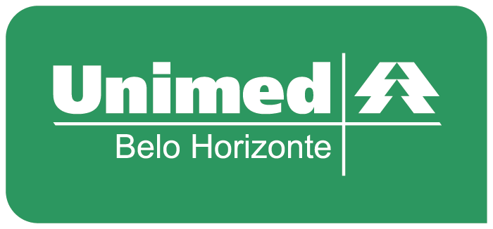

<h1 style="color:#0A5F55;font-weight:bold">
    Bootcamp Geração Tech Unimed-BH | FullStack </h1>

Olá! :smile:

Seja bem vindo ao meu repositório onde guardarei tudo que eu desenvolvi ao longo da edição **Fullstack** do Bootcamp
Repositório contendo tudo que foi desenvolvido durante o Bootcamp Geração Tech Unimed BH - Fullstack.

Este repositório está organizado por pastas, onde cada uma das pastas contém os arquivos desenvolvidos em cada um dos módulos.

Abaixo você pode acompanhar como os projetos estão se desenvolvendo

- [X] Módulo 1 - Princípios de Desenvolvimento de Software
    - Criação e publicação deste repositório :smiley:
- [ ] Módulo 2 - Fundamentos Web com HTML e CSS
- [ ] Módulo 3 - Conhecendo a Linguagem de Programação JavaScript
- [ ] Módulo 4 - Desenvolvimento Web com Angular
- [ ] Módulo 5 - Bancos de Dados Relacionais (SQL)
- [ ] Módulo 6 - Dominando o Ecossistema .NET e C#

  
  

